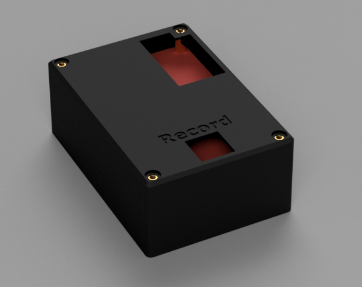

# Aerosol Chamber Research Data Logger
Arduion-based data logger to log 3 BME sensors (3-in-1 temperature, humidity, and air pressure sensor) every 0.5 seconds. 
Built for Aerosol research team at Aerosol Technologies Lab.

## Device Instructions
1. Plug in all 3 Sensors to the correct port
    1. VDD pins connect to VDD rail on the data logger
    1. GND pins connect to GND rail on the data logger
    1. Connect the SCL and SDA pin to the sensor input pins (refer to [Device Pinout](#device-pinout))
1. Insert the MicroSD card (refer to [microUSB Formatting](#microusb-formatting) for more information)
1. Insert the microUSB cable to the data logger
1. Press the button located at the top of the board to start recording. The LED should start flashing, indicating that logger is logging sensor data ([LED States](#led-states))
1. Press the same button as step 4 to stop recording, the LED should stop flashing

## Setting Up Development Environment
1. Install PlatformIO for VSCode
2. Build project using `nanoatmega328` profile

## Gallery
### Prototype

### CAD

## Hardware
### Components
- Arduino Nano (tested with old bootloader)
- TCA9548A - I2C Mux
- 3 BME 280
- 2 Push Buttons
- 1 LED
- 1 Resistor (For LED, use appropriate resistor for LED)
- 1 microSD card module
- 3 female header pins

### Device Pinout
|Pin     | Connection|
|:------:|-----------|
|1       | No connection |
|2       | No connection |
|3       | SCL3 |
|4       | SDA3 |
|5       | SCL2 |
|6       | SDA2 |
|7       | SCL1 |
|8       | SDA1 |

## microUSB Formatting
- microUSB card must be no greater than 32GB
- must be formatted to FAT32

## LED States
- Solid Off - Logger is not logging data or device is off
- Solid On - Logger encountered an error. Refer to [Notes](#notes) for information why the logger fails to initialize.
- Flashing On and Off - Data is logged to the microSD card

## Notes
- All 3 BME sensors must be plugged in correctly before device can initialize.
- The device may fail to initialize for the reason above or if 
    - Not all 3 sensors are plugged in
    - One or more BME sensor is not wired correctly
    - The microSD does not match the requirements (refer to [microUSB formatting](#microusb-formatting))
- The data logger can be reprogrammed to read other sensors
- The maximum theoretical amount of sensors is 24. The logger can be reprogrammed to accept up to 4. To use more than 5 sensors, slight modifications are necessary to the board and an external power supply that can supply sufficient current for all the sensors may be required.
